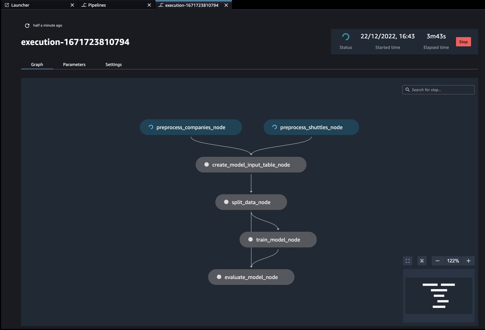

# Kedro SageMaker Pipelines plugin

[](https://github.com/getindata/kedro-sagemaker)
[](https://opensource.org/licenses/Apache-2.0)
[](https://semver.org/)
[](https://pypi.org/project/kedro-sagemaker/)
[](https://pepy.tech/project/kedro-sagemaker)

[](https://sonarcloud.io/summary/new_code?id=getindata_kedro-sagemaker)
[](https://sonarcloud.io/summary/new_code?id=getindata_kedro-sagemaker)
[](https://kedro-sagemaker.readthedocs.io/en/latest/?badge=latest)

<p align="center">
  <a href="https://getindata.com/solutions/ml-platform-machine-learning-reliable-explainable-feature-engineering"></a>
  <h3 align="center">We help companies turn their data into assets</h3>
</p>

## About
This plugin enables you to run Kedro projects on Amazon SageMaker. Simply install the package and use the provided `kedro sagemaker` commands to build, push, and run your project on SageMaker.




## Documentation 

For detailed documentation refer to https://kedro-sagemaker.readthedocs.io/

## Usage guide

```
Usage: kedro sagemaker [OPTIONS] COMMAND [ARGS]...

Options:
  -e, --env TEXT  Environment to use.
  -h, --help      Show this message and exit.

Commands:
  compile  Compiles the pipeline to a JSON file
  init     Creates basic configuration for Kedro SageMaker plugin
  run      Runs the pipeline on SageMaker Pipelines
```

## Quickstart
Follow **quickstart** section on [kedro-sagemaker.readthedocs.io](https://kedro-sagemaker.readthedocs.io/) to see how to run your Kedro project on AWS SageMaker.
