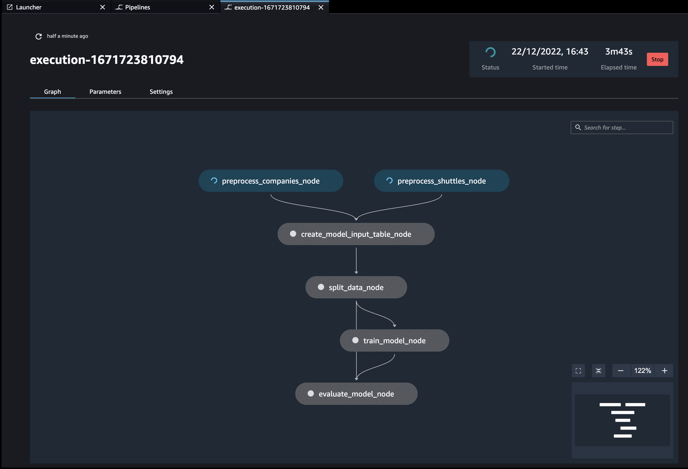
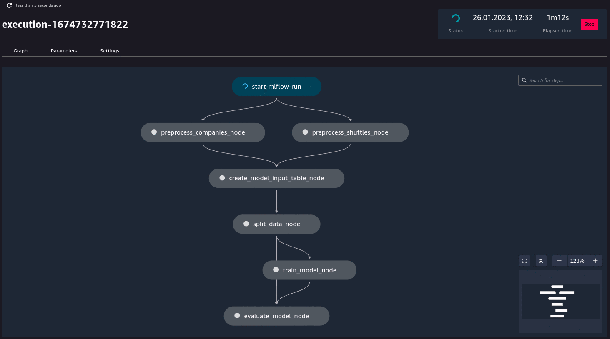

Quickstart
----------
You can go through the written quickstart here or watch the video on YouTube:

.. raw:: html

   <iframe width="560" height="315" src="https://www.youtube-nocookie.com/embed/yXIdz4kNMc8" title="YouTube video player" frameborder="0" allow="accelerometer; autoplay; clipboard-write; encrypted-media; gyroscope; picture-in-picture; web-share" allowfullscreen></iframe>

----

Before you start, make sure that you have the following:

-  AWS CLI installed
-  AWS SageMaker domain
-  SageMaker Execution role ARN (in a form `arn:aws:iam::<ID>:role/service-role/AmazonSageMaker-ExecutionRole-<NUMBERS>`). If you don't have one, follow the [official AWS docs](https://docs.aws.amazon.com/sagemaker/latest/dg/sagemaker-roles.html#sagemaker-roles-create-execution-role).
-  S3 bucket that the above role has R/W access
-  Docker installed
-  Amazon Elastic Container Registry (`Amazon ECR <https://aws.amazon.com/ecr/>`__) repository created that the above role has read access and you have write access

1. Prepare new virtual environment with Python >=3.8. Install the
   packages

.. code:: console

   pip install "kedro>=0.18.3,<0.19" "kedro-sagemaker"

2. Create new project (e.g. from starter). !!! Make sure you don't name it ``kedro-sagemaker`` because you will overwrite Python module name.

.. code:: console

    kedro new --starter=spaceflights

    Project Name
    ============
    Please enter a human readable name for your new project.
    Spaces, hyphens, and underscores are allowed.
     [Spaceflights]: kedro_sagemaker_demo

    The project name 'kedro_sagemaker_demo' has been applied to:
    - The project title in /Users/marcin/Dev/tmp/kedro-sagemaker-demo/README.md
    - The folder created for your project in /Users/marcin/Dev/tmp/kedro-sagemaker-demo
    - The project's python package in /Users/marcin/Dev/tmp/kedro-sagemaker-demo/src/kedro_sagemaker_demo

3. Go to the project's directory: ``cd kedro-sagemaker-demo``
4. Add ``kedro-sagemaker`` to ``src/requirements.txt``
5. (optional) Remove ``kedro-telemetry`` from ``src/requirements.txt``
   or set appropriate settings
   (`https://github.com/kedro-org/kedro-plugins/tree/main/kedro-telemetry <https://github.com/kedro-org/kedro-plugins/tree/main/kedro-telemetry>`__).
6. Install the requirements ``pip install -r src/requirements.txt``
7. Initialize Kedro SageMaker plugin. Provide name of the S3 bucket and full ARN of the SageMaker Execution role (which should also have access to the S3 bucket). For ``DOCKER_IMAGE`` - use full name of the ECR repository that you want to push your docker image.

.. code:: console

   #Usage: kedro sagemaker init [OPTIONS] BUCKET EXECUTION_ROLE DOCKER_IMAGE
   kedro sagemaker init <bucket-name> <role-arn> <ecr-image-uri>

The ``init`` command automatically will create:

- ``conf/base/sagemaker.yml`` configuration file, which controls this plugin's behaviour
- ``Dockerfile`` and ``.dockerignore`` files pre-configured to work with Amazon SageMaker

8. Adjust the Data Catalog - the default one stores all data locally,
   whereas the plugin will automatically use S3. Only
   input data is required to be read locally. Final
   ``conf/base/catalog.yml`` should look like this:

.. code:: yaml

   companies:
     type: pandas.CSVDataSet
     filepath: data/01_raw/companies.csv
     layer: raw

   reviews:
     type: pandas.CSVDataSet
     filepath: data/01_raw/reviews.csv
     layer: raw

   shuttles:
     type: pandas.ExcelDataSet
     filepath: data/01_raw/shuttles.xlsx
     layer: raw

9. (optional) Login to ECR, if you have not logged in before. You can run the following snippet in the terminal (adjust the region to match your configuration).

.. code:: console

    REGION=eu-central-1; aws ecr get-login-password --region $REGION | docker login --username AWS --password-stdin "<AWS project ID>.dkr.ecr.$(echo $REGION).amazonaws.com"

10. Run your Kedro project on AWS SageMaker pipelines with a single command:

.. code:: console

    kedro sagemaker run --auto-build -y

This command will first build the docker image with your project, push it to the configured ECR and then it will run the pipeline in AWS SageMaker pipelines service.

Finally, you will see similar logs in your terminal:

.. code:: console

    Pipeline ARN: arn:aws:sagemaker:eu-central-1:781336771001:pipeline/kedro-sagemaker-pipeline
    Pipeline started successfully

|Kedro SageMaker Pipelines execution|

Additionally, if you have (`kedro-mlflow <https://kedro-mlflow.readthedocs.io/en/stable/>`__) plugin installed, an additional node called `start-mlflow-run` will appear on execution graph. It's job is to log the SageMaker's Pipeline Execution ARN (so you can link runs with mlflow with runs in SageMaker) and make sure that all nodes use common Mlflow run.

|Kedro SageMaker Pipeline with Mlflow|

Resource customization
----
You can configure resources used by your nodes in `sagemaker.yml` under `resources` key

The definition of default values for nodes:

.. code:: yaml

  resources:
    __default__:
      instance_count: 1
      instance_type: ml.m5.large
      timeout_seconds: 86400
      security_group_ids: null
      subnets: null

How to specify custom resources?

.. code:: yaml

  resources:
    <NODE_NAME_OR_NODE_TAG>:
      instance_count: <NUMBER>
      instance_type: <INSTANCE TYPE STRING>
      timeout_seconds: <NUMBER>
      security_group_ids: <null OR LIST OF SECURITY GROUPS>
      subnets: <null OR LIST OF SUBNETS>

Example custom config:

.. code:: yaml

  resources:
    __default__:
      instance_count: 1
      instance_type: ml.m5.large
      timeout_seconds: 86400
      security_group_ids: null
      subnets: null
    train_on_gpu_node:
      instance_count: 1
      instance_type: ml.p3.2xlarge
      security_group_ids: ["example-security-group-id"]
      subnets: ["example-subnet-id"]
    some_test_node:
      instance_count: 1
      instance_type: ml.t3.medium

The default behavior is that only values defined in node resources will override `__default__` values and the rest is inherited.

So in this example

* `train_on_gpu_node` inherits `timeout_seconds: 86400` from `__default__`
* `some_test_node` inherits `timeout_seconds: 86400`, `security_group_ids: null` and `subnets: null` from `__default__`